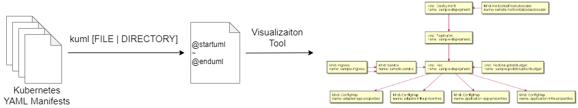
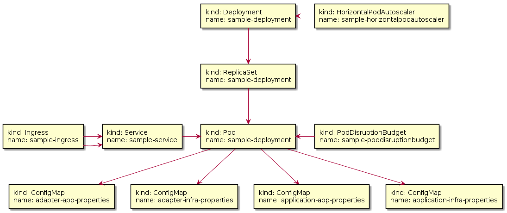

# kuml



Kuml is a kubernetes manifest visualization tool.

## Installation

### Source

```bash
go get -u github.com/gashirar/kuml
```

### krew plugin manager.

```bash
Sorry!
UnderConstruction!
```

## Usage

### Run
```bash
kuml example/application
```

### Output
```bash
@startuml
rectangle "kind: ConfigMap\nname: adapter-app-properties" as default_ConfigMap_adapter_app_properties
rectangle "kind: ConfigMap\nname: adapter-infra-properties" as default_ConfigMap_adapter_infra_properties
rectangle "kind: ConfigMap\nname: application-app-properties" as default_ConfigMap_application_app_properties
rectangle "kind: ConfigMap\nname: application-infra-properties" as default_ConfigMap_application_infra_properties
rectangle "kind: Deployment\nname: sample-deployment" as default_Deployment_sample_deployment
rectangle "kind: HorizontalPodAutoscaler\nname: sample-horizontalpodautoscaler" as default_HorizontalPodAutoscaler_sample_horizontalpodautoscaler
rectangle "kind: Ingress\nname: sample-ingress" as default_Ingress_sample_ingress
rectangle "kind: PodDisruptionBudget\nname: sample-poddisruptionbudget" as default_PodDisruptionBudget_sample_poddisruptionbudget
rectangle "kind: Pod\nname: sample-deployment" as default_Pod_sample_deployment
rectangle "kind: ReplicaSet\nname: sample-deployment" as default_ReplicaSet_sample_deployment
rectangle "kind: Service\nname: sample-service" as default_Service_sample_service
default_Deployment_sample_deployment -DOWN-> default_ReplicaSet_sample_deployment : ""
default_ReplicaSet_sample_deployment -DOWN-> default_Pod_sample_deployment : ""
default_Pod_sample_deployment -DOWN-> default_ConfigMap_adapter_app_properties : ""
default_Pod_sample_deployment -DOWN-> default_ConfigMap_adapter_infra_properties : ""
default_Pod_sample_deployment -DOWN-> default_ConfigMap_application_app_properties : ""
default_Pod_sample_deployment -DOWN-> default_ConfigMap_application_infra_properties : ""
default_Service_sample_service -RIGHT-> default_Pod_sample_deployment : ""
default_Ingress_sample_ingress -RIGHT-> default_Service_sample_service : ""
default_Ingress_sample_ingress -RIGHT-> default_Service_sample_service : ""
default_PodDisruptionBudget_sample_poddisruptionbudget -LEFT-> default_Pod_sample_deployment : ""
default_HorizontalPodAutoscaler_sample_horizontalpodautoscaler -LEFT-> default_Deployment_sample_deployment : ""
@enduml
```

### Generate UML diagram
In your favorite way.

-> [call it from your script using command line - PlantUML](https://plantuml.com/en/command-line/)  
-> [PlantUML Web Server](http://www.plantuml.com/plantuml/uml/)



### ToDo
- Workloads Resources
  - CronJob v1beta1 batch
    - [x] Element
    - [x] Link to Job
  - DaemonSet v1 apps
    - [ ] Element
    - [ ] Link to Pod
  - Deployment v1 apps
    - [x] Element
    - [x] Link to ReplicaSet
  - Job v1 batch
    - [x] Element
    - [x] Link to Pod
  - Pod v1 core
    - [x] Element
    - [x] Link to ConfigMap
    - [x] Link to Secret
    - [ ] Link to ServiceAccount
  - ReplicaSet v1 apps
    - [x] Element
    - [x] Link to Pod
  - ReplicationController v1 core
    - [ ] Element
    - [ ] Link to Pod
  - StatefulSet v1 apps
    - [x] Element
    - [x] Link to Pod
- Service Resources
  - Endpoints v1 core
    - [ ] Element
  - Ingress v1beta1 networking.k8s.io
    - [x] Element
    - [x] Link to Service
  - Service v1 core
    - [x] Element
    - [x] Link to Pod
- Config And Storage Resource
  - ConfigMap v1 core
    - [x] Element
  - Secret v1 core
    - [x] Element
  - PersistentVolumeClaim v1 core
    - [ ] Element
- Metadata Resources
  - HorizontalPodAutoscaler v1 autoscaling
    - [x] Element
    - [x] Link to Deployment
  - PodDisruptionBudget v1beta1 policy
    - [x] Element
    - [x] Link to Pod
  - PriorityClass v1 scheduling.k8s.io
    - [ ] Element
- Cluster Resources
  - ClusterRole v1 rbac.authorization.k8s.io
    - [ ] Element
  - ClusterRoleBinding v1 rbac.authorization.k8s.io
    - [ ] Element
  - Role v1 rbac.authorization.k8s.io
    - [ ] Element
  - RoleBinding v1 rbac.authorization.k8s.io
    - [ ] Element
  - ServiceAccount v1 core
    - [ ] Element
  - NetworkPolicy v1 networking.k8s.io
    - [ ] Element